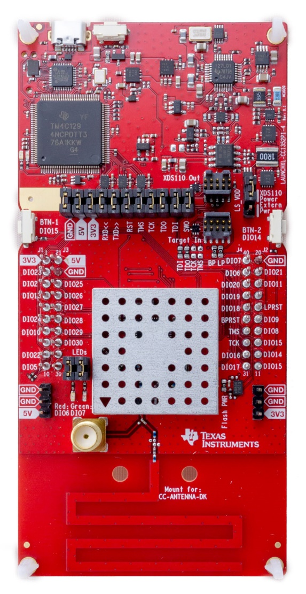
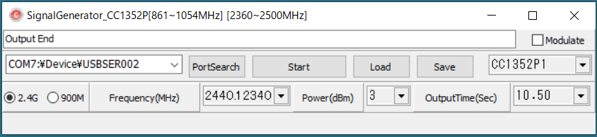
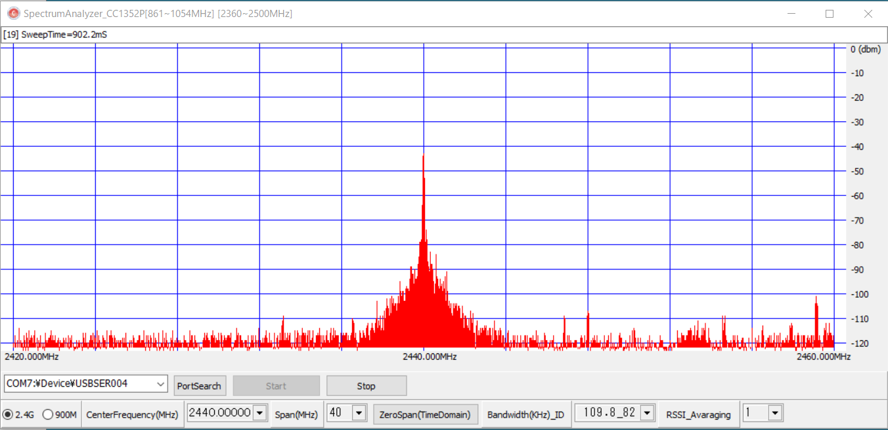
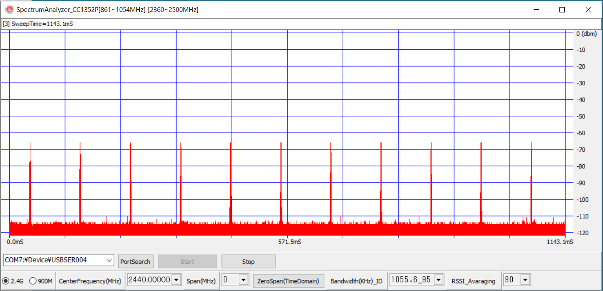

Backscatter汎用ツール

LAUNCHXL-CC1352Pを用いたツール

Texas Instruments Inc.のLaunchPad™
開発キットLAUNCHXL-CC1352P1及びLAUNCHXL-CC1352P-2で動作するソフトウエアです。

CC1352Pは2.4GHz帯、868/915MHz帯、433MHz帯で動作しBluetooth® Low
Energy、Sub-1GHz、Thread、Zigbee®、IEEE802.15.4等の通信プロトコルを搭載可能なSystem
On Chipです。

LAUNCHXL-CC1352P1及びLAUNCHXL-CC1352P-2はパソコンとUSBインターフェイスで接続して使用するデバッガ機能とCC1352Pを搭載したボードです。

LAUNCHXL-CC1352P1は868/915MHz帯で20dBm、2.4GHz帯で5dBm出力、

LAUNCHXL-CC1352P-2は868/915MHz帯で14dBm、2.4GHz帯で20dBm出力です。

{width="2.5853608923884512in"
height="5.011418416447944in"}

RF信号はボードのパターン・アンテナに接続されています。SMAコネクタに接続する場合は、アンテナ側に接続しているチップ・コンデンサを半田づけでSMAコネクタ側に繋ぎ変えて下さい。

ソフトウエア開発環境

(1)CC1352Pファームウエア開発環境

　Texas Instruments Inc.の無償の開発環境であるCode Composer Studio(CCS)
Version: 9.1.0.00010ソフトウェア開発キット(SDK)
SIMPLELINK-CC13X2-26X2-SDK\_3.20.00.68を用いて開発しています。この、CCSとSDKのバージョンを使用して下さい。(パソコンを新しくした時に、最新バージョンをインストールしましたがエラーだらけでした)

　完成したファームウエアは、CCSを用いてLAUNCHXL-CC1352Pに搭載されているCC1352Pのフラッシュメモリに書き込みます。

(2)Windows用GUI開発環境

Embarcadero C++Bilder XE2を用いて開発しています。

Embarcadero
C++Bilderの最新バージョンはアカデミックであれば、1年間無償で使用することが出来ます。これを用いて改造や機能追加をすることが出来ます。

簡易シグナルジェネレータ

　861～1054MHz及び2360～2500MHzの無変調の連続波又は変調の連続波を発生します。変調は861～1054MHzでは2FSK変調、2360～2500MHzではIEEE802.15.4のOQPSK変調です。

1.  CUI

　パソコン上のハイパーターミナル・ソフト(TeraTerm)等で操作します。

　　　ポート：COMXX:XDS110 Class Aplication/User UART(COMXX)

スピード:115200、データ:8bit、パリティ:Non、ストップビット:1

　ファームウエアのプロジェクト(ソースコード)ファイル

　　　　　　

(1)周波数設定(861～1054、2360～2500MHz、小数点以下5桁まで指定可能)

freq 2440.1234 ←入力コマンド

ACK\_freq\[2440.1234\]　　　　　 ←コマンドに対する応答

(2)出力電力設定(０～20ｄBm)

　　pow 3

　　ACK\_pow\[3\]

(3)出力時間設定(0.01～600秒)

　　tim 10.5

　　ACK\_tim\[10.50\]

(4)(1)～(3)の設定値をNVRAMに保存する。

sav

ACK\_sav\[freq=2440.123400 pow=3 time=10.500000\]

(5)NVRAMから設定値を読み出す。

　　rea

ACK\_rea\[freq=2440.123400 pow=3 time=10.500000\]

(6)変調設定

　　mod 1　　　　　　　　　　　　　← １：変調、0：無変調

ACK\_mod\[1\]

(7)電波発射

sta

Output End Time\[10501\]ms

2.  GUI

プログラムのプロジェクト(ソースコード)ファイル：CC1352P\_SG\_Win.zip

実行ファイル：CC1352P\_SG\_Win.exe

> {width="5.902777777777778in"
> height="1.3541666666666667in"}

(1) COMポートを選択

> LAUNCHXL-CC1352Pの接続しているCOMポートを選択します

(2) \[PortSearch\]ボタン

> このプログラムの起動後LAUNCHXL-CC1352PをUSB接続した場合などに、このボタンをクリックしてパソコンに接続されているCOMポートの情報を読み込みます。

(3)\[Start\]ボタン

　　電波を発射します。

(4)\[Load\]ボタン

　　NVRAMに保存した設定値を読み込みます。

(5)\[Save\]ボタン

　　現在の設定値をNVRAMに保存します。

(6)CC1352P1/CC1352P-2選択

　　LAUNCHXL-CC1352P1又はLAUNCHXL-CC1352P-2を選択します。

(7)\[2.4G/900M\]ラジオボタン

　　どちらの周波数帯域で使用するか選択します。

(8)周波数設定

　　周波数を選択又は入力します。入力する場合、小数点以下5桁まで指定可能です。

(9)出力電力設定

　　出力電力を選択又は入力します。

(10)出力時間設定

　　0.01～600秒の出力時間を選択又は入力します。

(11)\[Modulate\]チェックボックス

　　変調波を発生する場合はチェックします。無変調波の場合はチェックを外します。

簡易スペクトラムアナライザー

　CC1352Pの受信機能を用いた簡易スペクトラムアナライザーです。861～1054MHz又は2360～2500MHzの間の周波数を順次変化させながらRSSIを測定することで実現しています。

１．ファームウエア

　ファームウエアのプロジェクト(ソースコード)ファイル：CC1352P\_SA.zip

２．GUI

プログラムのプロジェクト(ソースコード)ファイル：CC1352P\_SA\_Win.zip

実行ファイル：CC1352P\_SA\_Win.exe

{width="5.902777777777778in"
height="2.861111111111111in"}

(1)COMポートを選択

> LAUNCHXL-CC1352Pの接続しているCOMポートを選択します。

(2)\[PortSearch\]ボタン

> このプログラムの起動後LAUNCHXL-CC1352PをUSB接続した場合などに、このボタンをクリックしてパソコンに接続されているCOMポートの情報を読み込みます。

(3)\[Start\]ボタン

　　スペクトラムアナライザー機能を起動します。

　　起動中は、\[Stop\]ボタン以外は操作できません。

(4)\[Stop\]ボタン

　　スペクトラムアナライザー機能を停止します。

(5)\[2.4G/900M\]選択ラジオボタン

　　2.4GHz帯又は900MHz帯を選択します。

(6)\[CenterFrequency(MHz)\]選択/入力

(7)\[Span(MHz)\] 選択/入力

(8)\[ZeroSpan(TimeDomain)\]ボタン

　　Spanを0にします。

　　この設定で\[Start\]すると横軸が時間(縦軸はRSSI)に代わりタイムドメインで動作しま

す。

{width="5.895833333333333in"
height="2.8541666666666665in"}

100mS毎に発生するIEEE802.15.4パケットを捉えた例

(9)\[Bandwidth(kHz)\_ID\]選択

　　CC1352PのReceiver bandwidthを設定しています。

　　IDはCC1352Pの内部設定値です。

(10)\[RSSI\_Avaraging\]選択

　　指定回数RSSIを測定して平均値を表示します。

　　回数に比例して測定時間が増加しますので、\[ZeroSpan(TimeDomain)\]の時の時間調整

に活用できます。

IEEE802.15.4パケット送信

　IEEE802.15.4形式のパケットを送信します。

１．CUI

　パソコン上のハイパーターミナル・ソフト(TeraTerm)等で操作します。

　　　ポート：COMXX:XDS110 Class Aplication/User UART(COMXX)

スピード:9600、データ:8bit、パリティ:Non、ストップビット:1

　ファームウエアのプロジェクト(ソースコード)ファイル：CC1352P\_15\_4\_Tx.zip

(1) ヘルプ画面

> 'H'、'h'又は'?'に続き\[enter\]を入力するとヘルプ画面を表示します。

\-\-\-\-\-\-\-\-\-\-\-\-\-\-\-\-\-\-\-\-\-\-\-\-\-\-\-\-\-\-\-\-\-\-\-\-\-\-\-\-\-\-\-\-\-\-\-\-\-\-\-\-\-\-\-\-\-\-\--

fre RF\_Frequency(MHz) float

pow RF\_Power(dBm) int

dstp Destnation PAN Addr HEX(16bit)

dstm Destnation MAC Addr HEX(16bit)

srcp Source PAN Addr HEX(16bit)

srcm Source MAC Addr HEX(16bit)

pay Payload Chractor char\[100\]

num Send Number of Packet int

del Delay between Packets int(mS)

csm CSMA(1:ON 0:OFF)

sta Start Send Packet(Press Any Key to Stop)

cw CW Generate 30\_\_600Sec

sav Parameters Save (Load when power is on)

\-\-\-\-\-\-\-\-\-\-\-\-\-\-\-\-\-\-\-\-\-\-\-\-\-\-\-\-\-\-\-\-\-\-\-\-\-\-\-\-\-\-\-\-\-\-\-\-\-\-\-\-\-\-\-\-\-\-\--

\-\-\-\-\-\-\-\-\-\-\-\-\-\-\-\-\-\-\-\-\-\-\-\-\-\-\-\-\-\-\-\-\-\-\-\-\-\-\-\-\-\-\-\-\-\-\-\-\-\-\-\-\-\-\-\-\-\-\--

freq\[2440.0000\]MHz Power\[0\]dBm

DstPAN\[FFFF\] DstMAC\[FFFF\] SrcPAN\[BA01\] SrcMAC\[BB01\]

Payload\[0123\]

Number of Packet\[1000\] Delay\[10\]mS CSMA\[1\]

> \-\-\-\-\-\-\-\-\-\-\-\-\-\-\-\-\-\-\-\-\-\-\-\-\-\-\-\-\-\-\-\-\-\-\-\-\-\-\-\-\-\-\-\-\-\-\-\-\-\-\-\-\-\-\-\-\-\-\--

　 上段がコマンドレファレンス、下段が現在の設定値です。

(2) 周波数設定

> 周波数範囲：2360～2500MHz
>
> 分解能　　：0.001MHz
>
> 例　　　　：fre 2440.001

(3) 送信電力設定

> 設定範囲　：0～20ｄBm
>
> 例　　　　：pow 10

(4)送信先PAN\_ID設定

> 16進4桁のPAN\_IDを設定します。
>
> 例　　　　：dstp FFFF

(5)送信先MACアドレス設定

> 16進4桁のMACアドレスを設定します。
>
> 例　　　　：dstm FFFF

(6)送信元PAN\_ID設定

> 16進4桁のPAN\_IDを設定します。
>
> 例　　　　：stcp BA01

(7)送信元MACアドレス設定

> 16進4桁のMACアドレスを設定します。
>
> 例　　　　：srcm FFFF

(8)ペイロードの設定

　　英数字記号を100文字まで設定できます。

(10)送信パケット数の設定

　　１～32ビット整数の最大値まで設定可能です。

例　　　　：num 100

(11)パケット送信間隔(mS)

　　0～32ビット整数の最大値まで設定可能です。

　　例　　　　：del 10

(12)CSMAオン/オフ

　　パケット送信に先立ってCSMAを行う、行わないを設定します。

　　例　　　　：csm 1

(13)送信スタート

　　各設定内容に従ってパケットを発生します。

　　例　　　　：sta

(14)無変調連続波(CW)発射

　　周波数偏差や送信電力の測定のために無変調連続波を発射します。

　　例　　　　：cw 60　　　　　← 60秒間

(15)設定値保存

　　現在の設定値をNVRAMに保存します。電源ON時、読みだして設定します。

　　例　　　　：sav

IEEE802.15.4パケット受信

　IEEE802.15.4形式のパケットを受信し、受信したパケットの内容を表示します。

１．CUI

　パソコン上のハイパーターミナル・ソフト(TeraTerm)等で操作します。

　　　ポート：COMXX:XDS110 Class Aplication/User UART(COMXX)

スピード:9600、データ:8bit、パリティ:Non、ストップビット:1

　ファームウエアのプロジェクト(ソースコード)ファイル：CC1352P\_15\_4\_Rx.zip

(1)ヘルプ画面

> 'H'、'h'又は'?'に続き\[enter\]を入力するとヘルプ画面を表示します。

\-\-\-\-\-\-\-\-\-\-\-\-\-\-\-\-\-\-\-\-\-\-\-\-\-\-\-\-\-\-\-\-\-\-\-\-\-\-\-\-\-\-\-\-\-\-\-\-\-\-\-\-\-\-\-\-\-\-\--

fre RF\_Frequency(MHz) float

dstm Destnation MAC Addr HEX(16bit)

srcm Source MAC Addr HEX(16bit)

sta Start Receive

sto Stop Receive(Display Statistics)

cw CW Generate 30\_\_600Sec

sp UART speed l:9600 h:230400 BPS

mo Receive Packet Dump Mode

g (G:Good/E:Error)

o (Dump Packet Overview)

d (Dump Packet Details)

sav Parameters Save (Load when power is on)

\-\-\-\-\-\-\-\-\-\-\-\-\-\-\-\-\-\-\-\-\-\-\-\-\-\-\-\-\-\-\-\-\-\-\-\-\-\-\-\-\-\-\-\-\-\-\-\-\-\-\-\-\-\-\-\-\-\-\--

\-\-\-\-\-\-\-\-\-\-\-\-\-\-\-\-\-\-\-\-\-\-\-\-\-\-\-\-\-\-\-\-\-\-\-\-\-\-\-\-\-\-\-\-\-\-\-\-\-\-\-\-\-\-\-\-\-\-\--

freq\[2440.0000\]MHz

DstMAC\[0000\] SrcMAC\[0000\]

UART speed\[9600\]BPS Receive Packet Dump Mode\[g\]

> \-\-\-\-\-\-\-\-\-\-\-\-\-\-\-\-\-\-\-\-\-\-\-\-\-\-\-\-\-\-\-\-\-\-\-\-\-\-\-\-\-\-\-\-\-\-\-\-\-\-\-\-\-\-\-\-\-\-\--

　 上段がコマンドレファレンス、下段が現在の設定値です。

(2)周波数設定

> 周波数範囲：2360～2500MHz
>
> 分解能　　：0.001MHz
>
> 例　　　　：fre 2440.001

(4) 送信先MACアドレス・フィルター

> 16進4桁の送信先MACアドレスを設定すると、送信先MACアドレスが一致する
>
> パケットのみ受信します。設定値が"0000"の場合はフィルター・オフです。
>
> 例　　　　：dstm 0000

(5)送信元MACアドレス・フィルター

　　16進4桁の送信元MACアドレスを設定すると、送信先MACアドレスが一致する

パケットのみ受信します。設定値が"0000"の場合はフィルター・オフです。

> 例　　　　：srcm BB01

(5) 受信スタート

> 受信を開始し、受信したパケットの内容を表示します。
>
> Receive Packet Dump
> Modeが'ｇ'の場合は、１パケット受信毎に、フレームチェック結果がGoodの場合は'Ｇ'、Errorの場合は'Ｅ'を表示します。
>
> 例　　　　：sta

Receive Start

> GGGEEGGGGGGGGGGGGGGGGGGGGGGGGGGGGG
>
> Receive Packet Dump
> Modeが'o'の場合は、１パケット受信毎に、パケットの概要を表示します。
>
> 例　　　　：sta

Receive Start

> \<GO\>RSSI\[-18\]dBm Seq\[5B\] SrcPAN\[BA01\] SrcMAC\[BB01\]
> Payload\[4\]byte
>
> \<GO\>RSSI\[-18\]dBm Seq\[61\] SrcPAN\[BA01\] SrcMAC\[BB01\]
> Payload\[4\]byte
>
> \<NG\>RSSI\[-96\]dBm Seq\[68\] SrcPAN\[3A96\] SrcMAC\[9575\]
> Payload\[33\]byte
>
> \<GO\>はフレームチェックGood、\<GO\>はErrorです。
>
> Receive Packet Dump
> Modeが'd'の場合は、１パケット受信毎に、パケットの詳細を表示します。
>
> 例　　　　：sta

Receive Start

> \<GO\> RSSI\[-18\] FCF\[8841\] Seq\[61\] Dst\[FFFF\]\[FFFF\]
> Src\[BA01\]\[BB01\]
>
> payload\[30 31 32 33 \]

(6) 受信ストップ

> 受信ストップすると、受信スタートがら受信したパケット数、その中のフレームチェック結果Goodパケット数、Errorパケット数を表示します。
>
> 例　　　　：sto
>
> Receive\[31\] Good\[26\] Error\[5\]

\(7) 無変調連続波(CW)発射

　　周波数偏差の測定のために無変調連続波を発射します。

　　例　　　　：cw 60　　　　　← 60秒間

cw\[60\]Sec END

(8)COMポート（UART）スピード

> 受信するパケットのレートが高いと、9600BPSでは受信したパケットの内容の表示中に次のパケットが現れて、パケットの取りこぼしをを起こします。スピードを230400BPSにして取りこぼしを少なくします。
>
> 例　　　　：sp h
>
> この後、ハイパーターミナル(Teratermなど)のスピードを230400BPSにして下さい。

(9)表示モード切替

> パケット内容の表示モードを変更します。
>
> 例　　　　：sp g ← g/o/h
>
> (受信スタート中でも変更でします。)

\(10) 設定値保存

　　現在の設定値をNVRAMに保存します。電源ON時、読みだして設定します。

　　例　　　　：sav

Backscatter TAG用 IEEE802.15.4パケット受信

　Backscatter
TAGのデモシステム用のIEEE802.15.4パケット受信ファームウエアです。Backscatter
TAGデモシステム用プログラムと組み合わせて使用します。

１．CUI

　パソコン上のハイパーターミナル・ソフト(TeraTerm)等で操作します。

　　　ポート：COMXX:XDS110 Class Aplication/User UART(COMXX)

スピード:230400、データ:8bit、パリティ:Non、ストップビット:1

　ファームウエアのプロジェクト(ソースコード)ファイル：BackscatterTAG\_15\_4\_Rx.zip

(1)ヘルプ画面

> 'H'、'h'又は'?'に続き\[enter\]を入力するとヘルプ画面を表示します。

\-\-\-\-\-\-\-\-\-\-\-\-\-\-\-\-\-\-\-\-\-\-\-\-\-\-\-\-\-\-\-\-\-\-\-\-\-\-\-\-\-\-\-\-\-\-\-\-\-\-\-\-\-\-\-\-\-\-\--

fre RF\_Frequency(MHz) float

sta Start Receive

sto Stop Receive(Display Statistics)

cw CW Generate 30\_\_600Sec

\-\-\-\-\-\-\-\-\-\-\-\-\-\-\-\-\-\-\-\-\-\-\-\-\-\-\-\-\-\-\-\-\-\-\-\-\-\-\-\-\-\-\-\-\-\-\-\-\-\-\-\-\-\-\-\-\-\-\--

\-\-\-\-\-\-\-\-\-\-\-\-\-\-\-\-\-\-\-\-\-\-\-\-\-\-\-\-\-\-\-\-\-\-\-\-\-\-\-\-\-\-\-\-\-\-\-\-\-\-\-\-\-\-\-\-\-\-\--

freq\[2440.0000\]MHz

> \-\-\-\-\-\-\-\-\-\-\-\-\-\-\-\-\-\-\-\-\-\-\-\-\-\-\-\-\-\-\-\-\-\-\-\-\-\-\-\-\-\-\-\-\-\-\-\-\-\-\-\-\-\-\-\-\-\-\--

(2)周波数設定

> 周波数範囲：2360～2500MHz
>
> 分解能　　：0.0001MHz
>
> 例　　　　：fre 2440.0001

(3) 受信スタート

> 例　　　　：sta

ACK\_sta

　　パケットを受信するとパケットのHEXダンプを表示します。

　　\[パケットレングス(10進)\|HEXダンプ\]

例) \[17\|418800FFFFFFFF01BA01BB30313233C037\]

\(4) 受信ストップ

> 例　　　　：sta

ACK\_sto

\(5) 無変調連続波(CW)発射

　　周波数偏差の測定のために無変調連続波を発射します。

　　例　　　　：cw 60　　　　　← 60秒間

cw\[60\]Sec END

Backscatter TAG用 簡易シグナルジェネレータ

　簡易シグナルジェネレータの通信スピードを230400BPSに変更したものです。

　ファームウエアのプロジェクト(ソースコード)ファイル：BackscatterTAG\_CW\_Tx.zip

Backscatter TAG用 IEEE802.15.4パケット送信

　IEEE802.15.4パケット送信の通信スピードを230400BPSに変更して、コマンドを追加したものです。

　Backscatter TAGデモシステム用プログラムと組み合わせて使用します。

１．CUI

　パソコン上のハイパーターミナル・ソフト(TeraTerm)等で操作します。

　　　ポート：COMXX:XDS110 Class Aplication/User UART(COMXX)

スピード:230400、データ:8bit、パリティ:Non、ストップビット:1

　ファームウエアのプロジェクト(ソースコード)ファイル：BackscatterTAG\_15\_4\_Rx.zip

(1)ヘルプ画面

'H'、'h'又は'?'に続き\[enter\]を入力するとヘルプ画面を表示します。

\-\-\-\-\-\-\-\-\-\-\-\-\-\-\-\-\-\-\-\-\-\-\-\-\-\-\-\-\-\-\-\-\-\-\-\-\-\-\-\-\-\-\-\-\-\-\-\-\-\-\-\-\-\-\-\-\-\-\--

fre RF\_Frequency(MHz) float

pow RF\_Power(dBm) int

dstp Destnation PAN Addr HEX(16bit)

dstm Destnation MAC Addr HEX(16bit)

srcp Source PAN Addr HEX(16bit)

srcm Source MAC Addr HEX(16bit)

pay Payload Chractor char\[100\]

num Send Number of Packet int

del Delay between Packets int(mS)

csm CSMA(1:ON 0:OFF)

sta Start Send Packet(Press Any Key to Stop)

cw CW Generate 30\_\_600Sec

sav Parameters Save (Load when power is on)

\-\-\-\-\-\-\-\-\-\-\-\-\-\-\-\-\-\-\-\-\-\-\-\-\-\-\-\-\-\-\-\-\-\-\-\-\-\-\-\-\-\-\--

rfo RF\_open　　　　　　　　　　　　　　　　 ← 追加したコマンド

rfc RF\_Close　　　　　　　　　　　　　　　　← 追加したコマンド

one DstMAC Paylod (Send One Packet)　　　　 ← 追加したコマンド

\-\-\-\-\-\-\-\-\-\-\-\-\-\-\-\-\-\-\-\-\-\-\-\-\-\-\-\-\-\-\-\-\-\-\-\-\-\-\-\-\-\-\-\-\-\-\-\-\-\-\-\-\-\-\-\-\-\-\--

\-\-\-\-\-\-\-\-\-\-\-\-\-\-\-\-\-\-\-\-\-\-\-\-\-\-\-\-\-\-\-\-\-\-\-\-\-\-\-\-\-\-\-\-\-\-\-\-\-\-\-\-\-\-\-\-\-\-\--

freq\[2440.0000\]MHz Power\[0\]dBm

DstPAN\[FFFF\] DstMAC\[FFFF\] SrcPAN\[BA01\] SrcMAC\[BB01\]

Payload\[0123\]

Number of Packet\[100\] Delay\[10\]mS CSMA\[1\]

\-\-\-\-\-\-\-\-\-\-\-\-\-\-\-\-\-\-\-\-\-\-\-\-\-\-\-\-\-\-\-\-\-\-\-\-\-\-\-\-\-\-\-\-\-\-\-\-\-\-\-\-\-\-\-\-\-\-\--

以降、追加したコマンドについて説明します。

(2)RF\_open

　　ソフトウエア的にRFハンドラをオープンします。

> 例　　　　：rfo
>
> ACK\_rfo

(4) RF\_Close

> ソフトウエア的にRFハンドラをクローズします。
>
> 例　　　　：rfc
>
> ACK\_rfc

(5) 1パケット送信

> オープンしたRFハンドラを用いて、
>
> 指定したMACアドレスに向けて、指定したPayloadのパケットを送信します。
>
> 例　　　　：one BA01 ABCDEFG
>
> ACK\_one
